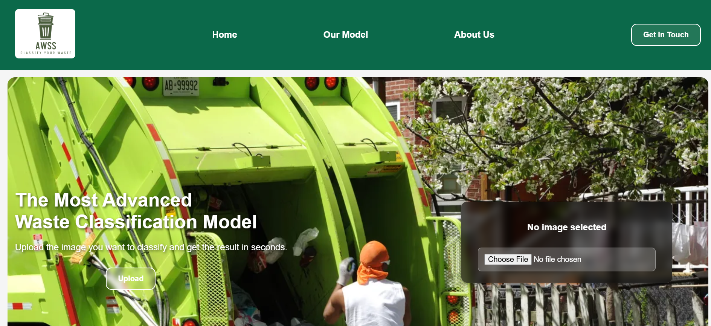
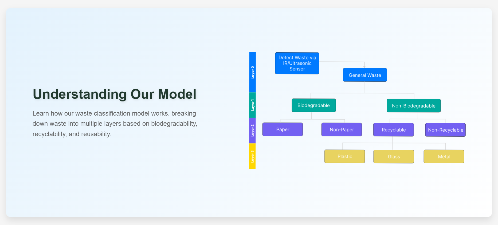

# Automatic Waste Segregation System (AWSS)

AWSS is a web-based application that uses Machine Learning to classify waste into different categories. Users can upload an image of waste, and the app will provide the classification results using a multi-layer ML model.

## 🛠️ Features
- Upload an image of waste for classification
- Get instant results with the predicted waste category
- User-friendly and responsive UI
- Error handling and clear messages for invalid inputs

## 🧪 How It Works
The system uses a three-layer machine learning model:
- **Layer 1 & Layer 2:** Binary classification models for initial segregation.
- **Layer 3:** Multi-class classification model for final waste type identification.

## 🚀 Technologies Used
- **Frontend:** React, JSX, CSS, Framer Motion
- **Backend:** Django, Python
- **Machine Learning:** TensorFlow, NumPy, OpenCV
- **API Integration:** Axios

## 📦 Installation and Setup
Follow these steps to set up the project locally:

1. **Clone the Repository:**
    git clone https://github.com/ShauviqMishra/awss.git  
    cd awss

2. **Backend Setup:**
    cd backend  
    python -m venv env  
    source env/bin/activate  # On Windows: env\Scripts\activate  
    pip install -r requirements.txt  
    python manage.py runserver  

3. **Frontend Setup:**
    cd AWSS  
    npm install  
    npm run dev  

The app will be available at `http://localhost:3000/`

## 🖼️ Screenshots
- **Homepage**  
  

- **Our Model**  
  

## 🛡️ Contributors
- **Shauviq Mishra:** Frontend Developer & Project Lead
- **Aanan:** Machine Learning Engineer
- **Samar Verma:** Documentation and Patent Specialist 

---
Made with ❤️ by Team AWSS

